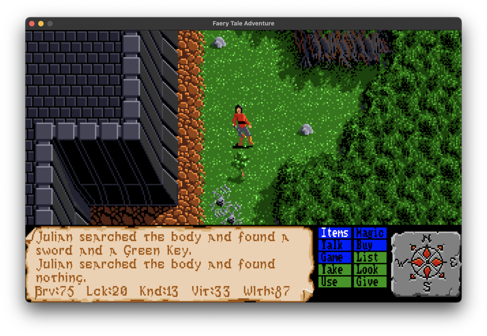
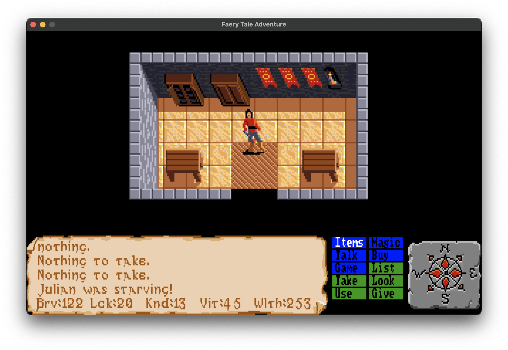
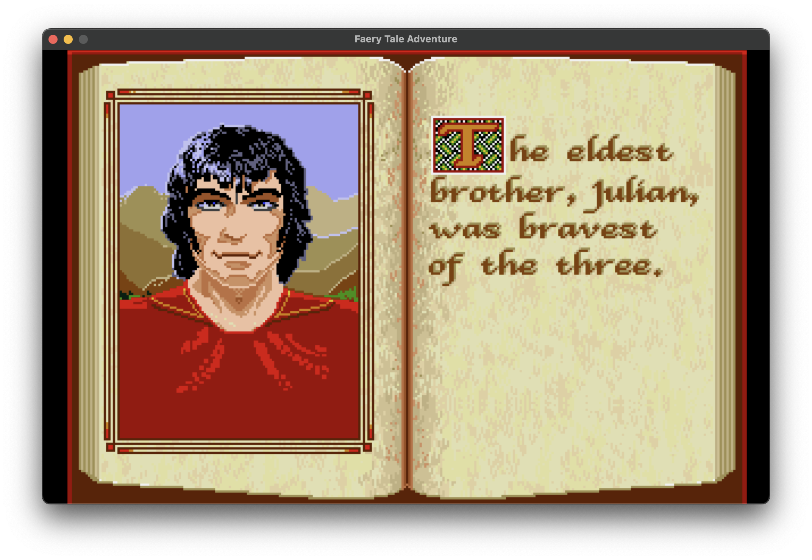
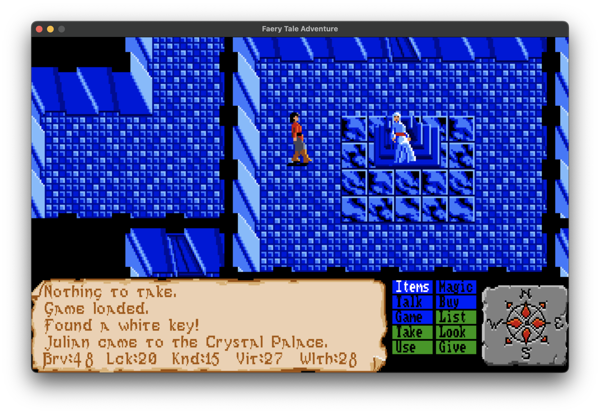
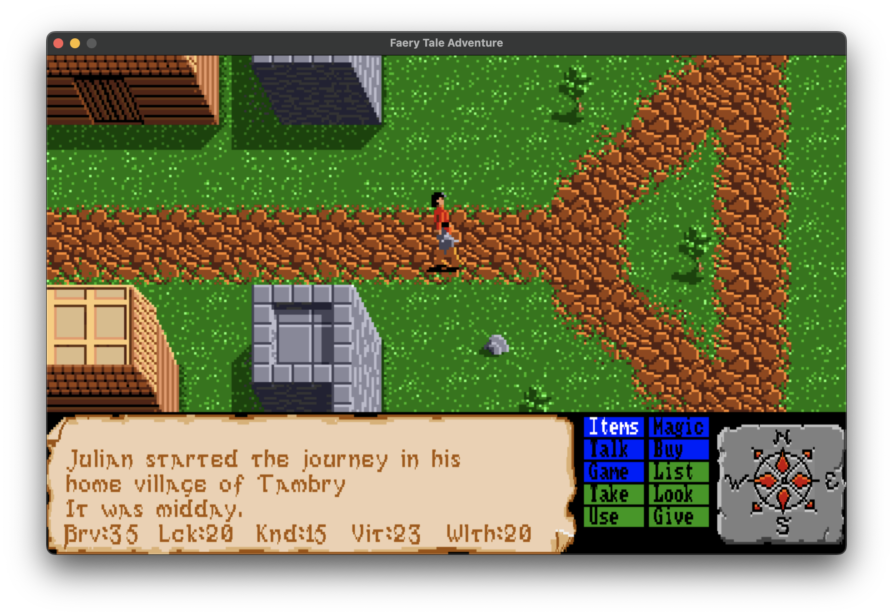
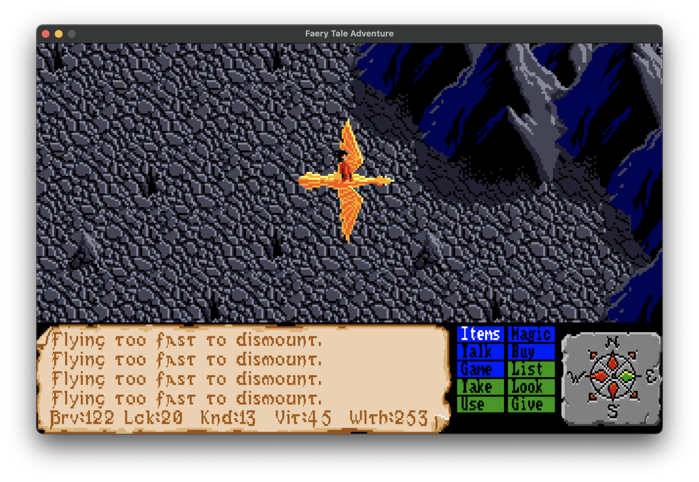

# Faery Tale Adventure - Modula-2 (mx) Port

Back in 1988 or so, I read about *The Faery Tale Adventure* for the Amiga in a computer magazine. The screenshots and description of the sheer size of the game, something like ~17,000 screens, just amazed me. I did not have an Amiga, but suddenly desperately wanted one so I could play this. I actually remember asking my Nan in the UK to buy the game for me before I even had the machine. I still have the original sleeve, map, and the 3.5" floppy it shipped on.

Since then I have played it on and off on real Amigas and via UAE. By modern standards it is not brilliant, but I still thoroughly enjoy it for nostalgia reasons, and the fantasy theme has always kept me coming back. I finished the game back in the day, and have always wanted to see a sequel.

Years later, Talin (David Joiner), the original "jack of all trades" behind this masterpiece, released the source code on GitHub. It is a mashup of 68k assembler and C, somewhat hard to follow and full of Amiga-specific hardware tricks, but the code really is a masterclass in algorithms and data structures.

So now I can see the source code behind the game. What next? Some people have started ports to other platforms using modern abstractions like SDL. I took a different approach. Why not try to port or recreate as much of it as possible using my own Modula-2 compiler, *mx*? It seemed like a good way to stress test the compiler.

*mx* had already been through a few projects, but this brought a lot of things together. It pushed the compiler further while letting me scratch that long-standing nostalgic itch.

I am immensely grateful to Talin for building the original game and then releasing the code all these years later, and also to Xark for extracting the assets! I hope I have done it some justice. It was(is ) not a straightforward job, but hopefully the resulting code is useful or at least interesting to others.

If you want to try *mx* or star the repo:
https://github.com/fitzee/mx

---

## Screenshots

<table>
<tr>
<td></td>
<td></td>
<td></td>
</tr>
<tr>
<td></td>
<td></td>
<td></td>
</tr>
</table>

---

## Building

You will need [mx](https://github.com/fitzee/mx) installed, along with SDL2.

```bash
git clone https://github.com/fitzee/FaeryTale-mx
git clone https://github.com/fitzee/sndys        # audio library
git clone https://github.com/fitzee/m2blitter     # Amiga Blitter "emulator"
cd FaeryTale-mx
mx build
.mx/bin/faerytale
```

> **Note:** This has been developed and tested on macOS. While it does compile for Linux and seems to mostly work, it has not been extensively tested on that platform.

---

## Current State

Mostly done, roughly 90 percent.

I have completed the main quest walkthrough to exercise different systems:
- carrier riding such as swan and turtle
- the witch in Grimwood
- stone ring teleporting
- the astral world
- revival fairy

Combat and enemy AI are close to the original, although this took the most time to get right.

Object spawning is also close, though there may be some variability in where things appear.

NPC interactions are close to original behavior. Day and night sequencing works, along with sleep and hunger mechanics. Inventory items behave as expected.

---

## What is not working or not final

- Save game is still a work in progress. It currently only saves location and inventory. This is mainly for testing purposes.
- Some animation sequences need another pass, for example drowning and falling.
- The raft has not been tested yet. Swan and turtle work well, so it should be fine.
- Occasional clipping edge cases still exist. These are not blockers but should be cleaned up.
- Music is mostly correct, but sound effects are placeholders.
- A full playthrough without cheats still needs to be done to validate overall game state.

---

## Planned improvements

- Full screen mode
- Controller and gamepad support

---

## Modula-2 Port vs Original (C / 68k ASM)

### What translates well

- Strong typing and explicit record structures make the data model clearer than the original’s loosely-typed C structs. Types like `Actor`, `WorldObject`, and `MissileRec` are self-describing where the original used `char` for everything from weapon codes to animation states.
- The module system (DEF/MOD separation) enforces cleaner boundaries than the original’s spread across large C files. Each concern lives in its own module with an explicit interface.
- PIM4 `CASE` statements map cleanly to the original’s switch/case tables (encounter charts, statelists, direction tables, menus).

### What fights you

- No array constant initializers, simple tables become procedural setup code:
  ```modula-2
  diroffs[0] := 16; diroffs[1] := 16; ...
  ```
- No 2D open array parameters, attempting `ARRAY OF ARRAY OF CHAR` as a parameter caused runtime faults in `mx`. Workarounds involve direct indexing or accessors instead of passing tables.
- Exported record array `VAR`s are unreliable across module boundaries, writes may not persist. Resolved by keeping data module-local and exposing via procedures.
- No unsigned types in PIM4, bitwise operations require explicit casting:
  ```modula-2
  inum := BOR(INTEGER(CARDINAL(inum)), 1);
  ```
- No `break` or `goto`, the original’s heavy use of `goto` for movement and collision fallback chains requires restructuring into nested conditionals or helper procedures.

---

## What the original does that’s genuinely clever

- Even and odd sprite interleaving, packs two subtypes into one sprite sheet with a single bit toggle. Halves asset count.
- Combat state machine (`trans_list`), 9 states with random transitions (4 exits each). About 36 bytes drives varied melee animation.
- Copper mode split, HUD rendered at higher horizontal resolution than the playfield via mid-frame mode switching. Replicated here via coordinate mapping.
- Environment ramp system, water depth and terrain effects modeled as gradual integer transitions instead of binary states.

---

## Architecture comparison

The original is a monolithic frame loop, movement, AI, rendering, collision, sound, and narrative all interleaved, sharing globals and local state inside large functions.

The Modula-2 port separates these into about 25 modules with explicit interfaces. This improves readability and isolation, but introduces friction where the original relied on direct global access. Systems that were tightly coupled now require explicit state passing.

The original’s structure is arguably more honest about how intertwined these systems are:
- AI directly influences rendering state  
- Movement triggers world transitions  
- Collision doubles as terrain detection  

Decoupling these requires additional plumbing that didn’t exist before.

---

## Selected implementation details

The port preserves many of the original’s underlying techniques:

- Copper-style dual-resolution rendering (HUD vs playfield)
- Tile masking for sprite occlusion
- Sector-based world layout with region wrapping
- Finite-state AI with goal and tactic separation
- Proximity-based encounter spawning
- Day and night palette modulation
- 8-direction quantized movement with collision fallback
- Projectile system reusing actor movement logic
- Trigger-based narration system
- Actor slot recycling
- Menu system mapped into HUD coordinate space

(Full list in project notes)

---

## Bottom line

Modula-2 produces more maintainable, structured code at the cost of verbosity and friction around low-level constructs.

The original C and 68k code is compact and direct, but difficult to reason about or modify safely.

The port is roughly 3× the line count for equivalent functionality, largely due to:
- procedural table initialization
- explicit type conversions
- stricter module boundaries

---

## Repository

If you want to try *mx* or explore the port:

https://github.com/fitzee/mx
